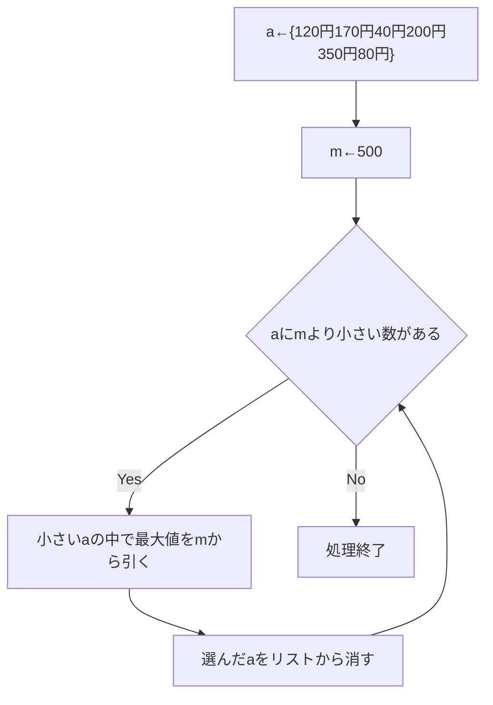

```mermaid
flowchart TD
nedan["a←{120円170円40円200円350円80円}"]
hani["m←500"]
hikaku{"aにmより小さい数がある"}
hiku[小さいaの中で最大値をmから引く]
kesu[選んだaをリストから消す]
nai[処理終了]

nedan --> hani
hani --> hikaku
hikaku -->|No| nai
hikaku -->|Yes| hiku
hiku --> kesu
kesu --> hikaku

```
